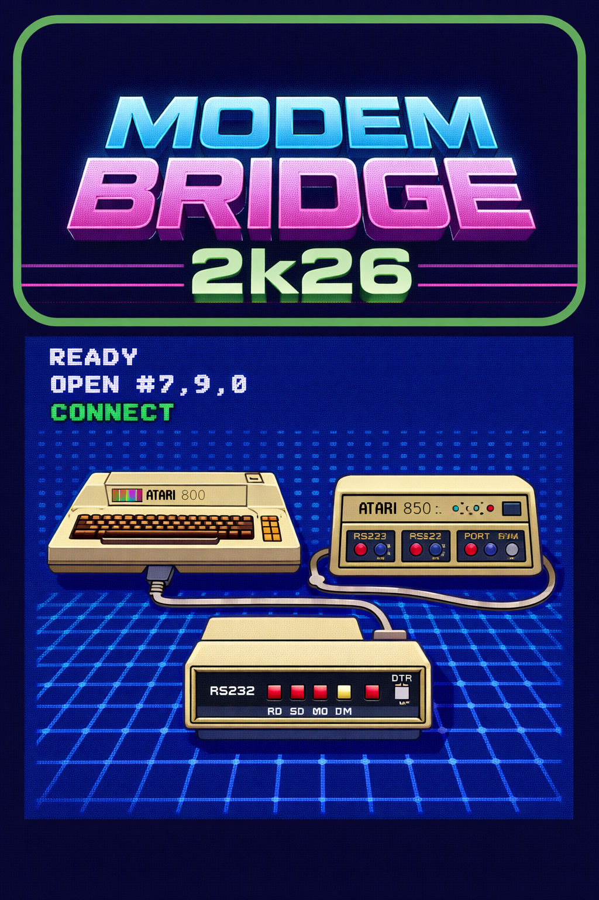

<div align="center">
  

  # Modem Bridge 2k26

  **Bridging the gap between the Atari 8-bit era and modern networks.**
  
  [](#)
  [](#)
  [](#)
</div>

---

## 📡 About

**Modem Bridge 2k26** is a modern utility designed to facilitate seamless communication between classic Atari 8-bit hardware and contemporary network environments. Whether you are dialing into legacy BBS systems, setting up a retro server, or just pushing data across the RS232 divide, this tool handles the heavy lifting.

Built with a nod to classic telecommunications, Modem Bridge 2k26 ensures your Atari 800 and 850 Interface Module can shake hands with the 21st century.

## ✨ Features

* **Atari 850 Emulation & Support:** Seamlessly integrates with the Atari 850 Interface Module's serial ports.
* **Modern Network Bridging:** Translates classic Hayes AT commands and RS232 serial data to modern TCP/IP connections.
* **Plug & Play Connectivity:** Drop-in support for your existing retro setups—no heavy hardware modifications required.
* **BBS Ready:** Perfect for getting back onto your favorite telnet bulletin board systems. 

## 🚀 Getting Started

### Prerequisites
* Atari 8-bit computer (400/800/XL/XE series)
* Atari 850 Interface Module (or compatible equivalent)
* An appropriate serial cable (RS232)
* A host machine running the Modem Bridge software

### Installation

1. Clone the repository to your modern host machine:
   ```bash
   git clone https://github.com/yourusername/modem-bridge-2k26.git
   cd modem-bridge-2k26
   ```
2. Build the project:
   ```bash
   make all
   ```

### Basic Usage

1. Connect your Atari to the host machine via the 850 interface.
2. Launch the bridge software on your host.
3. On your Atari, boot up your favorite terminal program.
4. Issue your connection commands:
   ```basic
   READY
   OPEN #7,9,0,"R1:"
   ```

## 🛠️ Configuration

Configuration can be managed via the `config.ini` file located in the root directory. Here you can set baud rates, default telnet addresses, and COM port assignments. 

## 🤝 Contributing

Contributions, issues, and feature requests are welcome! 
Feel free to check out the issues page if you want to contribute. 

## 📜 License

This project is licensed under the [GPL-3.0 License](LICENSE).

---
<div align="center">
  <i>"ATDT 1980"</i>
</div>
